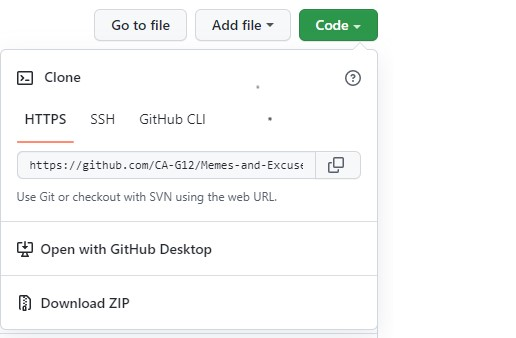

# Memes-and-Excuses
 Website for Memes and Excuses 

## ✧ Links
- [ live Link ](https://ca-g12.github.io/Memes-and-Excuses/)

## ✧ User Journey
- The user opens the application and views all Memes.
- The user can search for specific memes.
- User can view the Excuses by clicking on the button in the nav
- User goes through the Excuses page to show all the categories of the Excuses 
- User chooses one category it will show up all the Excuses for this one .
- User can search for a specific Excuses.

## ✧ User Stories
As a user : 
- When I open the application, I want to see all memes on the page.
- I can search for any memes I want by entering the name of the meme in the search bar. 
- When I click on the arrow in the nav bar, I will move to the excuser page
-  In the Excuser page, I want to see all situation categories 
- When I click in the category , I want to see all excuses that are related to that category
- ## ✧ How to install the project on your local machine.

## 

- You can click the _code_ drop-down menu as illustrated in the picture above and copy the link to clone the repo.
- Now go to your terminal and type: `git clone <the link here>` and then the repo will be cloned to your local machine.
- By now you have to open your IDE -I recommend VSCode- and open the project.
- to open a live page from your local machine project, you can download the `live Server` extension. This's a [link](https://marketplace.visualstudio.com/items?itemName=ritwickdey.LiveServer) to the extension.
- Now right click with your mouse and choose: Open with live server.
- Happy Coding!🤞

## ✧ The technologies we used.

- HTML5.
- CSS3.
- JavaScript.
- API
- Git & GitHub.
## ✧ Team members.

- [Salsabeel Al-Najjar](https://github.com/salsabeelomar).
- [Mohammad Balousha](https://github.com/MohammedOmar123)

